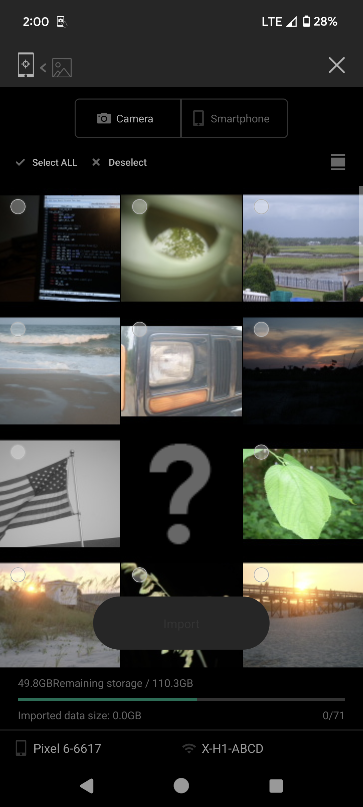
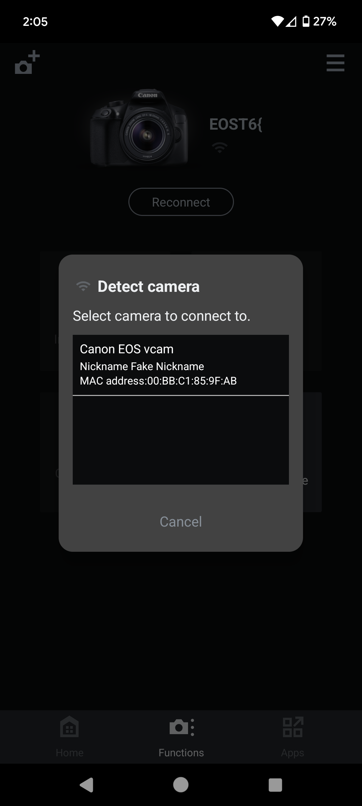

# vcam
This is a PTP (Picture Transfer Protocol) responder that reimplements the proprietary vendor extensions found in digital cameras.
Everything from filesystem access to remote capture, vcam tries to mimic the exact behavior of a camera. It also replicates
the USB and WiFi stack well enough that it can spoof official camera software:



All of this can be easily run on Linux - see below on instructions on how to run it.

---

*This started out as a fork of gphoto's [vcamera](https://github.com/gphoto/libgphoto2/tree/master/libgphoto2_port/vusb) regression tester.
Since then it has been heavily modified and improved to more closely replicate the PTP responders found in camera firmware.*

## Why
- Regression testing - Do extensive client testing in CI that can check for runtime bugs
- For easier prototyping - vcam can be used instead of a physical camera (no need to wait for a camera to recharge or reconnect to continue testing)
- [Black box testing](https://en.wikipedia.org/wiki/Black-box_testing) - test against vendor software without disassembling
- Reference - vcam tries to be a reference implementation of proprietary vendor functionality, showing what is happening behind the scenes (and sometimes why)

## Roadmap
- [x] Basic PTP responder implementation (thanks [Marcus Meissner](https://github.com/msmeissn))
- [x] Canon EOS implementation (WIP, Digic 4+, see canon.c)
- [x] libusb and vhci backends - see usb/
- [x] PTP/IP packet support
- [x] Fujifilm X TCP implementation (2015-2020)
- [x] Spoof [Fujifilm Camera Connect](https://play.google.com/store/apps/details?id=com.fujifilm_dsc.app.remoteshooter&hl=en_US&gl=US)
- [x] Spoof [EOS Connect](https://play.google.com/store/apps/details?id=jp.co.canon.ic.cameraconnect&hl=en_US&gl=US)
- [x] [Spoof Windows 11](https://x.com/danielcdev/status/1867440146389295532)
- [ ] Complete ISO MTP implementation
- [ ] open-source extensions (chdkptp, ML)
- [ ] DX + other mirrorless EOS implementation
- [ ] Canon Powershot (non-EOS) implementation
- [ ] Sony implementation? [pmca](https://github.com/ma1co/Sony-PMCA-RE)

## Compiling
```
sudo apt install libusb-1.0-0-dev libexif-dev
make vcam
```

## VHCI backend
This will connects the camera to your Linux PC through a virtual host controller:
```
sudo modprobe vhci-hcd
sudo ./vcam canon_1300d vhci
```

## libusb backend
The libusb API is hardly implemented, PRs improving this are welcome.
```
make libusb-vcam.so
```

## Running an access point
```
sudo apt install haveged hostapd
```
Power saving mode can make the TCP handshake way too slow:
```
# Doesn't last a reboot (I think)
sudo iw dev wlan0 set power_save off
```
See the makefile for more info on starting access points.
```
make ap-canon WIFI_DEV=wlan0
```

## Credits
Original Author (vusb): Marcus Meissner <marcus@jet.franken.de>  
Forked from https://github.com/gphoto/libgphoto2/tree/master/libgphoto2_port/vusb  
create_ap scripts from https://github.com/oblique/create_ap  
Licensed under the GNU Lesser General Public License v2.1  
