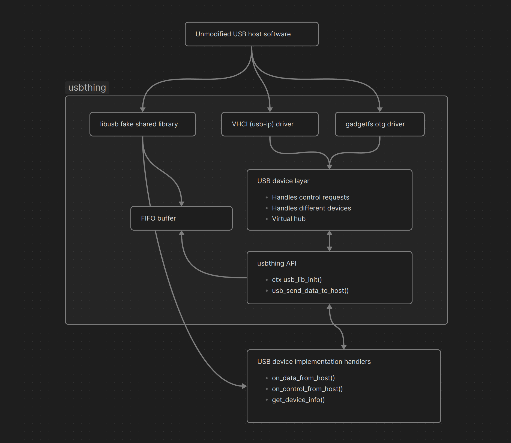

# usbthing

This is a general purpose layer for creating USB devices.

usbthing can be compiled with a *device implementation* that implements control requests, bulk transfers, and all other functionality.
This is called by an small (and optional) USB device layer, which is called by a *backend*. 

usbthing currently supports 3 different backends:
- *libusb-v1.0*
  A fake .so/.dll drop-in replacement for libusb-v1.0 - this is easy to manage and is great for CI testing.
- *vhci*
  Creates a device on the kernel's virtual host interface - ideal for routing to VMs
- *gadgetfs*
  The linux kernel interface over DWC - used to expose a device over a physical OTG port.

## Roadmap
- [x] Handlers for all common control requests
- [x] VHCI
- [x] libusb-v1.0
- [ ] gadgetfs (WIP)
- [x] Bulk endpoints
- [ ] Handle interrupt endpoint polling
- [ ] Virtual hub (if possible)
- [ ] Stable API and ABI
